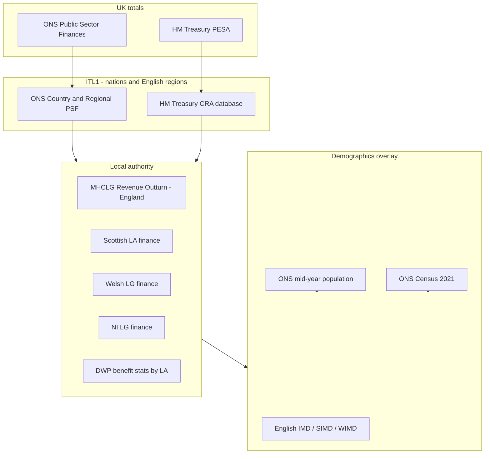

# Where UK government money is spent

A practical guide to answering **tax in vs spending out** for the UK, its devolved nations, English regions, and (eventually) council areas — using official government data.

**Latest complete year used here:** financial year ending March 2025 (FYE 2024-25).

---

## Short answer (FYE 2024-25)

| | £ billion | % of spending |
|---|---:|---:|
| **Money in** (public sector current receipts) | **1,134** | |
| **Money out** (total managed expenditure) | **1,291** | 100% |
| **Gap (borrowing)** | **156** | |

The UK government spent **£156bn more than it raised** in taxes and other receipts. That gap is funded by borrowing (gilts), which is why debt interest is itself a major spending line.

### Where the £1,291bn went (by function)

| Function | £bn | % of total |
|---|---:|---:|
| Social protection (pensions, benefits, tax credits) | 387 | 30.0% |
| Health | 242 | 18.8% |
| General public services (incl. **debt interest £127bn**) | 160 | 12.4% |
| Education | 123 | 9.5% |
| Economic affairs (transport, business support, etc.) | 88 | 6.9% |
| Defence | 64 | 4.9% |
| Public order & safety | 52 | 4.0% |
| Housing & community | 22 | 1.7% |
| Environment | 17 | 1.3% |
| Recreation, culture & religion | 15 | 1.2% |
| Accounting adjustments | 123 | 9.5% |

**Debt interest alone is ~£127bn (~10% of all spending).** It sits under COFOG “general public services”, not as its own top-level category.

### Devolved nations & English regions (identifiable spending vs revenue)

ONS allocates spending on a **“who benefits”** basis (where residents/enterprises benefit, not necessarily where civil servants sit). Revenue uses **“who pays”** (where tax is raised — e.g. income tax by residence, VAT assumed borne by consumers).

| Area | Revenue £bn | Identifiable spend £bn | Balance £bn | Spend/head | Revenue/head |
|---|---:|---:|---:|---:|---:|
| **UK** | 1,134 | 936* | — | 18,628 | 16,437 |
| London | 240 | 138 | **−102** | 21,017 | 26,454 |
| South East | 181 | 116 | **−65** | 17,162 | 18,855 |
| East of England | 107 | 81 | **−26** | 16,971 | 16,349 |
| South West | 89 | 73 | **−16** | 17,684 | 15,248 |
| Scotland | 88 | 86 | −1 | 21,117 | 15,880 |
| Yorkshire & Humber | 76 | 73 | +4 | 17,705 | 13,484 |
| North West | 106 | 107 | +1 | 18,829 | 13,722 |
| West Midlands | 82 | 81 | 0 | 18,225 | 13,237 |
| East Midlands | 67 | 62 | −5 | 16,808 | 13,287 |
| Wales | 41 | 48 | +7 | 20,168 | 13,083 |
| North East | 33 | 39 | +6 | 19,071 | 11,977 |
| Northern Ireland | 24 | 31 | +7 | 20,866 | 12,714 |
| England (total) | 981 | 770 | **−211** | 18,235 | 16,795 |

\*Identifiable expenditure (£936bn) is less than total managed expenditure (£1,291bn). The **£355bn gap** is spending that benefits the UK as a whole (defence, much of debt interest, foreign aid, etc.) plus national-accounts adjustments. It is **not** fully allocatable to regions.

**London and the South East are large net contributors** on this basis; Wales, Northern Ireland and the North East receive more identifiable spending than they raise in revenue.

---

## Tax income by type and region (FYE 2024-25)

ONS **Table S9** breaks down public sector receipts by tax type for each ITL1 region. The pipeline also layers **HMRC Income Tax Liabilities Statistics** for income tax by marginal rate band.

### UK revenue mix

| Tax type | £bn | % of revenue |
|---|---:|---:|
| Income tax | 306 | 26.7% |
| National insurance | 174 | 15.2% |
| VAT | 173 | 15.1% |
| Corporation tax | 93 | 8.1% |
| Council tax | 47 | 4.1% |
| Business rates | 29 | 2.5% |
| Capital gains tax | 14 | 1.2% |
| Fuel & excise duties | 45 | 3.9% |
| Other (incl. interest, GOS) | 263 | 23.1% |

### How the mix shifts by region

| Region | Income tax | NIC | VAT | Corp tax | Council tax |
|---|---:|---:|---:|---:|---:|
| **UK** | 27% | 15% | 15% | 8% | 4% |
| London | **33%** | 15% | 10% | **14%** | 3% |
| South East | 30% | 15% | 14% | 9% | 4% |
| North East | 22% | 16% | 17% | 5% | 6% |
| Wales | 21% | 16% | 18% | 5% | 7% |
| Scotland | 24% | 16% | 16% | 7% | 5% |

London's revenue is skewed toward **income tax and corporation tax** (high earners and businesses by residence); Wales and the North East rely more on **VAT and council tax** as a share of local revenue.

### Income tax by marginal band (modelled by region)

HMRC does not publish regional receipts by band directly. The pipeline estimates band shares using:

1. **Payer counts** by marginal band and region (HMRC ITLS Table 2.2)
2. **UK average liability** per payer in each band (ITLS Table 2.5)
3. **Scaled** to ONS regional income tax totals (Table S9)

| Region | Basic rate | Higher rate | Additional rate | Total IT £bn |
|---|---:|---:|---:|---:|
| London | 15% | 28% | **57%** | 79.2 |
| South East | 28% | 38% | 34% | 39.5 |
| North East | 44% | 35% | 21% | 7.1 |
| Wales | 42% | 36% | 22% | 8.7 |

London is dominated by additional-rate payers; poorer regions have more basic-rate payers.

**Caveats:**

- Revenue is on an **accruals** basis and allocated by **residence**, not workplace
- ITLS 2024-25 band data is **projected** from 2021-22 SPI
- Scottish/Welsh rates appear in payer classification, not as separate band names
- **Council tax property bands** (A–H) are a different concept — not yet in the pipeline

**Output:** `data/processed/revenue_by_type_region_fye2025.json` (run `python scripts/build_fiscal_summary.py`)

### Council tax by property band (A–H, plus I in Wales)

Council tax is a **property** tax, not an income tax. The pipeline combines:

| Source | Geography | What it provides |
|---|---|---|
| VOA CTSOP 1.0 | 9 English regions + Wales | Dwellings by band A–H (I in Wales) |
| NRS dwelling estimates | Scotland | Dwellings by band A–H |
| ONS Table S9 | Same regions | Council tax receipts (£bn) |

Receipts are **estimated by band** using the standard Band-D-equivalent weighting (A=6/9 of Band D, … H=18/9). Northern Ireland has **no council tax** — it uses domestic rates instead (not split by band in ONS data).

Example (London, FYE 2024-25): ~6.1bn council tax; Bands D–G account for most revenue because of the weighting, despite more properties in lower bands.

---

## How far back does the data go?

See `data/processed/data_coverage.json` (generated by `python scripts/data_coverage.py`). Summary:

| Dataset | Period | Geography |
|---|---|---|
| ONS Country & Regional PSF (revenue & spending) | **FYE 2000-01 → 2024-25** | ITL1 |
| VOA Council Tax stock (CTSOP) | **1993 → 2024** | England & Wales (region/LA) |
| HMRC Income Tax Liabilities (bands) | **1999-2000 → 2024-25** tax years | UK; regions for payer counts |
| HM Treasury CRA segments | **2020-21 → 2024-25** in current file | ITL1 |
| HM Treasury CRA merged (GOV.UK editions) | **2008-09 → 2024-25** | ITL1 identifiable spend |
| HM Treasury PESA TME (merged ch. 4) | **1967-68 → 2025-26** | UK |
| HM Treasury PESA by function (merged ch. 4) | **1987-88 → 2024-25** | UK COFOG Level 0 |
| NRS Scotland dwellings by band | **2005 → 2024** | Scotland (data zone; aggregated in pipeline) |
| MHCLG Council Taxbase | **1993 → 2024** | England local authorities |

**Not yet in the pipeline:** England LA revenue outturn (2017-18+), council-level fiscal balances, NI domestic rates by band.

To refresh historical HM Treasury data:

```bash
python scripts/download_hm_treasury.py          # CRA 2013–25, PESA 2010–25
python scripts/download_hm_treasury.py --force-pesa  # re-download PESA after URL fixes
python scripts/build_cra_history.py
python scripts/build_pesa_history.py
```

---

## The right fiscal totals to use

Different publications measure slightly different things. For “as close as possible to total tax in vs all outgoings including interest”, use:

### 1. UK total — ONS Public Sector Finances (PSF)

- **Receipts:** `Total public sector current receipts` (~£1,134bn FYE 2024-25)
- **Spending:** `Total managed expenditure` (TME) (~£1,291bn)
- **Includes:** debt interest, social security, NHS, local government, public corporations
- **Source:** [ONS PSF bulletin](https://www.ons.gov.uk/economy/governmentpublicsectorandtaxes/publicsectorfinance/bulletins/publicsectorfinances/latest) and [time series](https://www.ons.gov.uk/economy/governmentpublicsectorandtaxes/publicsectorfinance/datasets/publicsectorfinances/current)

### 2. Spending by policy area — HM Treasury PESA / Public Spending Statistics

- **Framework:** Total Expenditure on Services (TES) by COFOG function
- **~90% of TME**; reconciled via accounting adjustments
- **Source:** [PESA 2025](https://www.gov.uk/government/statistics/public-expenditure-statistical-analyses-2025), [Public Spending Statistics](https://www.gov.uk/government/statistics/public-spending-statistics-release-december-2025/public-spending-statistics-december-2025)

### 3. Regional split — ONS Country & Regional PSF + HM Treasury CRA

| Layer | Geography | Revenue | Expenditure | Best source |
|---|---|---|---|---|
| UK | Whole country | ✓ | ✓ | ONS PSF |
| ITL1 | 4 nations + 9 English regions | ✓ | ✓ | [ONS CR PSF](https://www.ons.gov.uk/economy/governmentpublicsectorandtaxes/publicsectorfinance/datasets/countryandregionalpublicsectorfinancesexpendituretables) |
| Segment | ITL1 × department × function | ✗ | ✓ (identifiable only) | [CRA database](https://www.gov.uk/government/statistics/country-and-regional-analysis-2025) |
| Local authority | Council / UA | partial | partial (mostly LG only) | See below |

**Key methodological rules (CRA / ONS):**

- **Identifiable** spending → allocated to a region where beneficiaries live
- **Non-identifiable** spending → UK-wide (defence, debt interest, overseas aid, etc.)
- **Devolved spending** (health, education in Scotland/Wales/NI) → attributed directly to that nation
- **Local authority spending** → region of the spending authority

---

## What you cannot get perfectly (and why)

| Question | Reality |
|---|---|
| “Every pound of tax I paid — where did it go?” | No single ledger exists. Revenue and spending are compiled from different admin systems on an **accruals** basis. |
| “Council X: tax in vs spend out” | **No official full fiscal balance at LA level.** ONS scoping study found only **parts** of revenue and spending are available at district level. |
| “Match my council tax to local spend” | Council tax (~£47bn UK-wide) funds only a **fraction** of local spending; most LA income is grants from central government. |
| “Regional totals sum to UK total” | Identifiable spending sums to ~£936bn; **£355bn is not regionally allocated**. Revenue regional splits are modelled from HMRC/ONS microdata. |

---

## Roadmap to council level + demographics



### Layer 1 — Council-visible spending (most reliable)

**Local government own expenditure** is reported consistently:

| Nation | Dataset | Granularity |
|---|---|---|
| England | [MHCLG Revenue Outturn](https://www.gov.uk/government/collections/local-authority-revenue-expenditure-and-financing) | 317 LAs, by service (RO1–RO6) |
| Scotland | [Local Government Finance Statistics](https://www.gov.scot/collections/local-government-finance-statistics/) | 32 councils |
| Wales | [Local authority revenue and capital](https://www.gov.wales/local-authority-revenue-and-capital-outturn) | 22 councils |
| Northern Ireland | [NI LA finance](https://www.finance-ni.gov.uk/topics/local-government-finance) | 11 councils |

ONS research ([Using local authority financial data…](https://www.ons.gov.uk/economy/governmentpublicsectorandtaxes/publicsectorfinance/articles/usinglocalauthorityfinancialdatatoimprovethegranularityofpublicsectorexpenditureuk/latest)) shows these can be harmonised across the UK for **local government expenditure only** (~15–20% of total public spending).

### Layer 2 — Central government spending at LA level (requires modelling)

Elements with **admin data at LA or postcode level:**

- DWP / HMRC **benefits and tax credits** (by recipient residence)
- **NHS** spending (ICB / former CCG areas — not identical to council boundaries)
- **Education** funding ([Explore Education Statistics](https://explore-education-statistics.service.gov.uk/))
- **Business rates & council tax** (LA actuals)

Elements that must be **apportioned** from CRA segments using proxies (population, GVA, SPI tax data):

- Defence, debt interest, foreign aid
- Most Whitehall programme spend

The [CRA 2025 database](https://www.gov.uk/government/statistics/country-and-regional-analysis-2025) (`CRA_2025_Database_for_Publication.xlsx`) has ~20k rows at **segment × ITL1 × function** — the best raw material for disaggregating ITL1 → LA.

### Layer 3 — Demographics

Join fiscal data to:

| Variable | Source | Geography |
|---|---|---|
| Population | ONS mid-year estimates (used in CR PSF Table S12) | LA / MSOA |
| Age profile | Census 2021 | OA → LA |
| Deprivation | [IMD 2025](https://www.gov.uk/government/statistics/english-indices-of-deprivation-2025) (England), SIMD, WIMD | LSOA → LA |
| Employment / income | HMRC PAYE / ONS ASHE | ITL / LA |

Useful derived metrics:

- Spend per head, revenue per head, net balance per head (ONS already publishes at ITL1)
- Spend per child / pensioner (needs age breakdown)
- Spend vs deprivation decile (needs LSOA aggregation)

---

## Recommended data stack for this repo

```
data/raw/
  crpsf_fye2025_exp.xlsx      # ONS regional expenditure
  crpsf_fye2025_rev.xlsx      # ONS regional revenue
  crpsf_fye2025_supp.xlsx     # Per-head, population
  cra2025_db.xlsx             # CRA segment-level spend (current edition)
  pesa_ch1.xlsx               # UK TME reconciliation (current edition)
  hm_treasury/                # Historical CRA (2013–25) & PESA (2010–25) from GOV.UK

data/processed/
  fiscal_summary_fye2025.json # Generated summary
  cra_expenditure_history.json
  pesa_expenditure_history.json

scripts/
  build_fiscal_summary.py     # Pulls latest numbers from ONS workbooks
  revenue_breakdown.py        # Tax revenue by type, region, and IT band
  council_tax_bands.py        # Council tax property stock and receipts by band A–H
  data_coverage.py            # Historical span of each dataset
  download_hm_treasury.py     # Scrape & download CRA/PESA editions from GOV.UK
  build_cra_history.py        # Merge CRA databases → regional spend time series
  build_pesa_history.py       # Merge PESA ch4 → UK TME & COFOG function time series

data/processed/
  fiscal_summary_fye2025.json
  revenue_by_type_region_fye2025.json
  data_coverage.json
```

Run:

```bash
pip install -r requirements.txt
python scripts/build_fiscal_summary.py
```

### Next build steps (for council + demographics viz)

1. **Ingest** MHCLG Revenue Outturn multi-year CSV (England) + devolved equivalents
2. **Map** LA codes to ITL1 regions (ONS lookup tables)
3. **Apportion** CRA non-LG segments to LAs (population for generic services; benefit claimant counts for DWP lines)
4. **Join** Census/IMD for demographic faceting
5. **Document uncertainty** — show identifiable vs apportioned vs non-allocatable as separate layers in the UI

---

## Key official links

| Purpose | URL |
|---|---|
| ONS PSF (UK totals) | https://www.ons.gov.uk/economy/governmentpublicsectorandtaxes/publicsectorfinance |
| ONS Country & Regional PSF | https://www.ons.gov.uk/economy/governmentpublicsectorandtaxes/publicsectorfinance/datasets/countryandregionalpublicsectorfinancesexpendituretables |
| ONS CR PSF methodology | https://www.ons.gov.uk/economy/governmentpublicsectorandtaxes/publicsectorfinance/methodologies/countryandregionalpublicsectorfinancesmethodologyguide |
| HM Treasury CRA 2025 | https://www.gov.uk/government/statistics/country-and-regional-analysis-2025 |
| HM Treasury PESA 2025 | https://www.gov.uk/government/statistics/public-expenditure-statistical-analyses-2025 |
| Sub-regional PSF scoping (LA feasibility) | https://www.ons.gov.uk/economy/governmentpublicsectorandtaxes/publicsectorfinance/articles/subregionalpublicsectorfinances/scopingstudy |
| England LA revenue outturn | https://www.gov.uk/government/collections/local-authority-revenue-expenditure-and-financing |

---

## Devolution note

| Policy area | England | Scotland | Wales | Northern Ireland |
|---|---|---|---|---|
| Health | UK-wide NHS England model | Devolved (SG) | Devolved (WG) | Devolved (NI exec) |
| Education | DfE / LA | Devolved | Devolved | Devolved |
| Social security | DWP (mostly reserved) | DWP + devolved benefits | DWP + devolved benefits | DWP + devolved benefits |
| Income tax | UK rates | Scottish rates/bands | Welsh rates (UK bands) | UK rates |
| Local government | MHCLG | COSLA/SG | WG | DfC NI |

For **Scotland and Wales**, also see GERS and Welsh Government fiscal analyses — these use similar CRA-based methods but present devolved-government perspectives.
